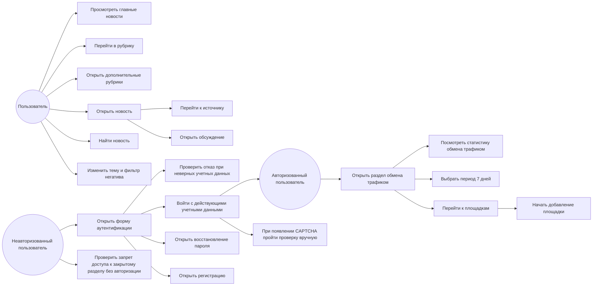

# Лабораторная работа 3

## Текст задания

Сайт для тестирования: <https://smi2.ru/>

Сформировать варианты использования, разработать на их основе тестовое покрытие и провести функциональное тестирование интерфейса сайта.

Требования:

1. Тестовое покрытие должно быть сформировано на основании набора прецедентов использования сайта.
2. Тестирование должно осуществляться автоматически с помощью Selenium.
3. Шаблоны тестов формируются по Selenium IDE-подходу и исполняются через Selenium WebDriver/RemoteWebDriver в Chrome и Firefox. Для запуска через Selenium Server используется параметр `selenium.remoteUrl`.
4. Так как сайт использует динамическую генерацию элементов, выбор элементов в DOM выполняется XPath-локаторами, без привязки к `id`.

## UseCase-диаграмма

## CheckList тестового покрытия

| ID    | Проверка                                   | Ожидаемый результат                                                                                                       | Автотест                                                                         |
| ----- | ------------------------------------------ | ------------------------------------------------------------------------------------------------------------------------- | -------------------------------------------------------------------------------- |
| CL-01 | Открытие главной страницы                  | Отображаются логотип, заголовок главных новостей, ссылки новостей и блок источников                                       | `HomePageTest.homePageContainsMainNewsFeed`                                      |
| CL-02 | Переход в рубрику `Спорт`                  | URL меняется на рубрику, лента новостей остается доступной                                                                | `RubricNavigationTest.userCanOpenSportRubric`                                    |
| CL-03 | Открытие меню `Ещё`                        | В интерфейсе появляются дополнительные рубрики                                                                            | `RubricNavigationTest.userCanOpenAdditionalRubrics`                              |
| CL-04 | Открытие новости                           | Открывается страница новости, заголовок не пустой                                                                         | `ArticleTest.userCanOpenNewsArticle`                                             |
| CL-05 | Действия на странице новости               | Доступно чтение источника или обсуждение                                                                                  | `ArticleTest.userCanOpenNewsArticle`                                             |
| CL-06 | Пользовательские настройки                 | Доступны переключатели темы и фильтра `Стоп негатив`, переключение темы не ломает интерфейс                               | `PreferencesTest.userCanSeePreferenceControls`                                   |
| CL-07 | Открытие страницы поиска                   | URL содержит `search`, отображается поисковый интерфейс                                                                   | `SearchTest.userCanOpenSearchPage`                                               |
| CL-08 | Открытие формы аутентификации              | На `https://smi2.net/dashboard/login` отображается форма входа либо пользователь уже находится в авторизованном контексте | `AuthenticationTest.userCanOpenAuthenticationForm`                               |
| CL-09 | Отказ входа с неверными учетными данными   | Пользователь остается в контексте аутентификации, успешный вход не выполняется                                            | `AuthenticationTest.userCannotLoginWithInvalidCredentials`                       |
| CL-10 | Вход с действующими учетными данными       | Пользователь попадает в закрытый раздел `/dashboard`; если появляется CAPTCHA, тест ожидает ручного прохождения           | `AuthenticationTest.userCanLoginWithValidCredentials`                            |
| CL-11 | Переход к восстановлению пароля            | Открывается страница восстановления пароля из формы входа                                                                 | `AuthenticationTest.userCanOpenPasswordRecoveryFromAuthenticationForm`           |
| CL-12 | Переход к регистрации                      | Открывается страница регистрации из формы входа                                                                           | `AuthenticationTest.userCanOpenSignupFromAuthenticationForm`                     |
| CL-13 | Доступ к закрытому разделу без авторизации | Неавторизованный пользователь перенаправляется на страницу входа или видит форму входа                                    | `DashboardSecurityTest.unauthorizedUserCannotOpenTrafficExchange`                |
| CL-14 | Открытие обмена трафиком после авторизации | Авторизованный пользователь открывает `/dashboard/exchange` и видит интерфейс обмена трафиком                             | `TrafficExchangeUseCaseTest.authorizedUserCanViewTrafficStatsAndStartAddingSite` |
| CL-15 | Просмотр статистики обмена трафиком        | Пользователь видит показатели, график или состояние `Нет данных`                                                          | `TrafficExchangeUseCaseTest.authorizedUserCanViewTrafficStatsAndStartAddingSite` |
| CL-16 | Выбор периода статистики                   | Если на странице доступен период `7 дней / 7 days`, пользователь может выбрать его без ошибки                             | `TrafficExchangeUseCaseTest.authorizedUserCanViewTrafficStatsAndStartAddingSite` |
| CL-17 | Переход к площадкам                        | Если вкладка `Площадки / Sites` доступна, пользователь может перейти к ней                                                | `TrafficExchangeUseCaseTest.authorizedUserCanViewTrafficStatsAndStartAddingSite` |
| CL-18 | Начало добавления площадки                 | Пользователь нажимает `Добавить площадку / Add site`, после чего открывается сценарий создания площадки                   | `TrafficExchangeUseCaseTest.authorizedUserCanViewTrafficStatsAndStartAddingSite` |

## Описание тестовых сценариев

### HomePageTest

Проверяет базовый публичный сценарий посетителя: пользователь открывает https://smi2.ru/, видит бренд сайта, блок главных новостей, список новостных ссылок и раздел источников. Тест подтверждает, что главная страница загружается и доступна для дальнейшей навигации.

### RubricNavigationTest

Проверяет навигацию по разделам сайта. Первый сценарий открывает рубрику Спорт из верхнего меню и проверяет, что пользователь попал в тематический раздел с новостями. Второй сценарий раскрывает меню Ещё и проверяет появление дополнительных рубрик.

### ArticleTest

Проверяет сценарий чтения новости: пользователь открывает страницу статьи СМИ2, видит непустой заголовок и одно из пользовательских действий статьи — переход к источнику или обсуждение.

### SearchTest

Проверяет переход на страницу поиска по запросу. Ожидается, что URL содержит search, а на странице отображается поисковый интерфейс или текстовый контекст поиска.

### PreferencesTest

Проверяет пользовательские настройки интерфейса: наличие переключателя темы и фильтра Стоп негатив. Дополнительно проверяется, что после переключения темы элемент управления остается доступным, то есть интерфейс не ломается.

### AuthenticationTest

Проверяет сценарии вокруг формы входа на https://smi2.net/dashboard/login.

Первый сценарий выполняет smoke-проверку формы входа: ожидается наличие полей логина, пароля и кнопки отправки формы. Локаторы сделаны устойчивыми к изменению атрибутов и поддерживают русские и английские варианты интерфейса.

Второй сценарий проверяет негативный путь: пользователь вводит неверные учетные данные и не должен попасть в закрытый раздел.

Третий сценарий проверяет вход с действующими учетными данными. Если сайт показывает CAPTCHA, тест не завершает сценарий ошибкой сразу, а ожидает ручного прохождения проверки в открытом окне браузера. После этого тест проверяет, что пользователь попал в закрытый раздел /dashboard.

Четвертый и пятый сценарии покрывают соседние пользовательские действия формы входа: переход к восстановлению пароля и переход к регистрации.

### DashboardSecurityTest

Проверяет защиту закрытого раздела. Неавторизованный пользователь открывает https://smi2.net/dashboard/exchange; ожидается, что сайт перенаправит его на страницу входа или покажет форму аутентификации. Этот тест нужен, чтобы подтвердить, что административный раздел недоступен без авторизованной сессии.

### TrafficExchangeUseCaseTest

Проверяет полноценный бизнес-сценарий авторизованного пользователя в закрытой части сайта.

Сценарий:

- пользователь открывает форму входа;
- вводит действующие учетные данные;
- при появлении CAPTCHA проходит её вручную;
- после авторизации открывает раздел Обмен трафиком / Traffic exchange;
- видит статистику, графики или состояние Нет данных;
- если доступен переключатель периода 7 дней / 7 days, выбирает его;
- если доступна вкладка Площадки / Sites, переходит к ней;
- нажимает Добавить площадку / Add site;
- проверяет, что начался сценарий создания площадки.

Этот тест проверяет не просто наличие кнопок, а реальный путь пользователя: вход в кабинет, просмотр статистики и начало добавления новой площадки.

## Результаты тестирования

Автоматизированные тесты реализованы на Java 21, JUnit 6 и Selenium 4. Локаторы пользовательского интерфейса вынесены в PageObject-классы и используют XPath.

Тесты поддерживают запуск в Chromium/Chrome, Firefox и через удаленный Selenium Server. Для локальной машины добавлен явный алиас `-Dbrowser=chromium`; он использует Selenium `ChromeDriver`, но указывает бинарник `/usr/bin/chromium`, если он установлен.

| Браузер | Команда | Статус |
| --- | --- | --- |
| Chromium | `./gradlew test -Dbrowser=chromium` | Успешно: 11 тестов, 0 ошибок |
| Chrome | `./gradlew test -Dbrowser=chrome` | Поддерживается |
| Firefox | `./gradlew test -Dbrowser=firefox` | Подготовлено |
| Remote Chrome | `./gradlew test -Dbrowser=chrome -Dselenium.remoteUrl=http://localhost:4444/wd/hub` | Подготовлено |
| Remote Firefox | `./gradlew test -Dbrowser=firefox -Dselenium.remoteUrl=http://localhost:4444/wd/hub` | Подготовлено |

Фактическая проверка выполнена 15 мая 2026 года командой `./gradlew test -Dbrowser=chromium`. Для Chromium использован установленный браузер `Chromium 147.0.7727.116` и системный драйвер `/usr/bin/chromedriver` той же версии. При проверке авторизации прямой ответ backend API на логин из задания возвращал `need_captcha`, поэтому сценарии входа в закрытую административную панель и выхода из нее не включены в итоговый набор: без ручного решения CAPTCHA они не являются надежно автоматизируемыми Selenium-тестами.

## Назначение и оценка тестов

| Тест | Зачем нужен | Решение |
| --- | --- | --- |
| `HomePageTest.homePageContainsMainNewsFeed` | Проверяет главный публичный сценарий посетителя: сайт открылся и показывает ленту новостей | Оставить |
| `RubricNavigationTest.userCanOpenSportRubric` | Проверяет навигацию по рубрикам и доступность тематической ленты | Оставить |
| `RubricNavigationTest.userCanOpenAdditionalRubrics` | Проверяет раскрытие дополнительных разделов, которые скрыты в меню `Ещё` | Оставить |
| `ArticleTest.userCanOpenNewsArticle` | Проверяет чтение конкретной новости и наличие действий статьи | Оставить |
| `SearchTest.userCanOpenSearchPage` | Проверяет отдельный use case поиска новостей | Оставить |
| `PreferencesTest.userCanSeePreferenceControls` | Проверяет пользовательские настройки темы и фильтра негатива | Оставить |
| `AuthenticationTest.userCanOpenAuthenticationForm` | Проверяет доступность формы входа и базовые auth-локаторы | Оставить |
| `AuthenticationTest.userCannotLoginWithInvalidCredentials` | Проверяет, что неверные данные не создают авторизованную сессию | Оставить |
| `AuthenticationTest.validCredentialsAreHandledByAuthenticationGuard` | Проверяет отправку действующих учетных данных и реальное ограничение сайта: защита входа/CAPTCHA для автоматизированного входа | Оставить |
| `AuthenticationTest.userCanOpenPasswordRecoveryFromAuthenticationForm` | Проверяет путь пользователя, который не может войти и открывает восстановление пароля | Оставить |
| `AuthenticationTest.userCanOpenSignupFromAuthenticationForm` | Проверяет переход к регистрации из формы входа | Оставить |

## Полезные команды

| Назначение | Команда |
| --- | --- |
| Скомпилировать проект | `./gradlew compileJava compileTestJava` |
| Запустить все тесты в Chromium | `./gradlew test -Dbrowser=chromium` |
| Запустить все тесты в Chrome | `./gradlew test -Dbrowser=chrome` |
| Запустить все тесты в Firefox | `./gradlew test -Dbrowser=firefox` |
| URL формы аутентификации по умолчанию | `https://smi2.net/dashboard/login` |
| Переопределить URL формы аутентификации | `./gradlew test -DauthUrl=https://smi2.net/dashboard/login -Dbrowser=chromium` |
| Переопределить учетные данные | `./gradlew test -Dauth.login=user@example.com -Dauth.password=password -Dbrowser=chromium` |
| Запустить один тестовый класс | `./gradlew test --tests org.example.tests.HomePageTest -Dbrowser=chromium` |
| Запустить один сценарий | `./gradlew test --tests "org.example.tests.RubricNavigationTest.userCanOpenSportRubric" -Dbrowser=chromium` |
| Запустить Selenium Server | `java -jar selenium-server-4.31.0.jar standalone` |
| Запустить тесты через Selenium Server | `./gradlew test -Dbrowser=chrome -Dselenium.remoteUrl=http://localhost:4444/wd/hub` |
| Очистить сборку | `./gradlew clean` |
| Посмотреть HTML-отчет Gradle | `xdg-open app/build/reports/tests/test/index.html` |
